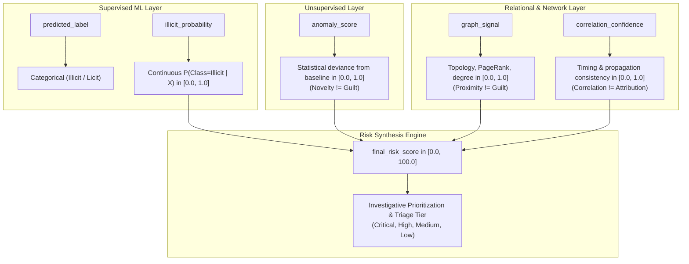
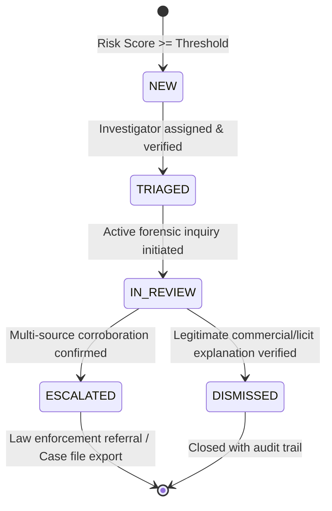

# Kautilya — Evaluation Metrics, Score Distributions, and Probability Interpretation

## 1. Executive Summary

Kautilya is an investigative decision-support system designed for cryptocurrency transaction forensics. The platform synthesizes machine learning predictions, unsupervised anomaly scores, graph structural patterns, and temporal network correlations to prioritize cases for forensic investigators.

This document establishes the formal definitions, statistical methodologies, and forensic principles governing:
1. **Model Evaluation Under Extreme Class Imbalance**
2. **Temporal Validation and Data Leakage Prevention**
3. **Probability Interpretation vs. Confidence vs. Risk**
4. **Multi-Signal Score Distributions and Triage Thresholds**
5. **Entity-Level Aggregation Distributions and Non-Accusation Principles**
6. **Investigative Alert Prioritization and Queue Management**

---

## 2. Evaluation Metrics Under Extreme Class Imbalance

### 2.1 Dataset Composition & The Accuracy Paradox
The Elliptic++ Bitcoin dataset contains approximately 203,769 transactions across 49 discrete time steps:
- **Illicit (Class 1):** ~4,545 transactions (~2.2% of the dataset)
- **Licit (Class 2):** ~42,019 transactions (~20.6% of the dataset)
- **Unknown (Class 3):** ~157,205 transactions (~77.2% of the dataset, excluded from supervised training)

In this highly imbalanced regime (~1:10 ratio among labeled transactions), standard classification metrics such as **Accuracy** and standard **ROC-AUC** are fundamentally misleading:
- A naive baseline classifier that predicts *every* transaction to be "Licit" achieves **90.2% accuracy** while detecting **0% of illicit actors** ($Recall = 0$).
- ROC-AUC evaluates the true positive rate against the false positive rate. Because the negative class (licit) is vastly larger than the positive class, a model can incur thousands of false alarms while its ROC-AUC remains superficially high (e.g., >0.90) because the denominator of the false positive rate ($FP / (FP + TN)$) is dominated by the large volume of true negatives.

### 2.2 Mandatory Primary Metrics
Per `AGENTS.md §7`, supervised classification evaluation must report metrics appropriate for class imbalance:

| Metric | Formula | Operational Forensic Interpretation | Target Threshold |
| :--- | :--- | :--- | :--- |
| **Precision** | $\frac{TP}{TP + FP}$ | Measures triage efficiency. High precision ensures investigators do not suffer alert fatigue from chasing false leads. | $\ge 0.70$ |
| **Recall (Sensitivity)** | $\frac{TP}{TP + FN}$ | Measures evasion prevention. High recall ensures illicit transactions and money laundering chains are not overlooked. | $\ge 0.60$ |
| **F1 Score** | $2 \cdot \frac{Precision \cdot Recall}{Precision + Recall}$ | Harmonic mean balancing false positives against missed detections. | $\ge 0.65$ |
| **PR-AUC (Average Precision)** | $\int_0^1 P(R) \, dR$ | **Primary evaluation benchmark.** Evaluates the area under the Precision-Recall curve across all decision thresholds without dilution by true negatives. | Benchmark against baseline |
| **Balanced Accuracy** | $\frac{Recall_{illicit} + Recall_{licit}}{2}$ | Measures average recall across both classes equally, preventing class dominance. | $\ge 0.75$ |

### 2.3 Temporal Split Strategy (Anti-Leakage Protocol)
Cryptocurrency transaction graphs evolve over time. Random k-fold cross-validation or uniform train/test shuffling causes severe **temporal data leakage**:
- Future transactions would leak topological and behavioral information into past predictions.
- The model would learn from future graph connectivity that did not exist at the time of the transaction.

Kautilya mandates a strict **temporal split protocol**:
- **Training Pool:** Time steps $1 \le t \le 34$ (~70% of chronological horizon).
- **Out-of-Time Test Pool:** Time steps $35 \le t \le 49$ (~30% of chronological horizon).
- Models must be evaluated strictly on future time steps that were completely unseen during training, feature scaling, and imputation.

---

## 3. Probability Interpretation vs. Model Confidence vs. Risk Score

A foundational forensic principle of Kautilya is that **model outputs, statistical deviance, and investigative risk are distinct concepts and must never be used interchangeably** (`AGENTS.md §3.6`, `CONTEXT.md`).

### 3.1 The Seven Core Signal Categories

1. **`predicted_label` (Categorical Classification):**
   - The discrete class assigned by the supervised model (`Illicit`, `Licit`, or `Unknown`).
   - Represents the model's categorical prediction at its operational threshold ($\tau = 0.50$).

2. **`illicit_probability` (Continuous Likelihood):**
   - The continuous conditional probability $P(\text{class} = \text{Illicit} \mid X) \in [0.0, 1.0]$ estimated by the supervised classifier (Random Forest or XGBoost).
   - **Critical Rule:** Confidence in the *licit* class must never be confused with risk. A model that is 99% confident that a transaction is licit has an `illicit_probability` of 0.01 and a risk score near zero. It must never be interpreted as a 99% risk score.

3. **`anomaly_score` (Statistical Deviance):**
   - Statistical deviance from the learned baseline distribution generated by the Isolation Forest model, normalized to $[0.0, 1.0]$.
   - **Forensic Principle: Anomaly $\neq$ Illicitness.** An unusual transaction (e.g., an unusually large legal institutional transfer, or a new batching script) is statistically novel, but not criminal. An anomaly score alone must NEVER be presented as proof of illicit conduct.

4. **`graph_signal` (Structural / Relational Patterns):**
   - Graph-derived metric $\in [0.0, 1.0]$ reflecting high degree centrality, PageRank, or proximity to known illicit clusters.
   - **Forensic Principle: Graph proximity alone does not prove guilt.** Interacting with a counterparty that previously received illicit funds does not automatically make the entity a co-conspirator.

5. **`correlation_confidence` (Plausibility of Connection):**
   - Composite metric $\in [0.0, 1.0]$ measuring temporal proximity, propagation timing consistency, and topology consistency between an on-chain transaction and a network observation.
   - **Forensic Principle: Correlation $\neq$ Attribution.** Temporal proximity between an IP broadcast and a block inclusion indicates connection plausibility, but does not prove wallet ownership or physical identity.

6. **`final_risk_score` (Investigative Prioritization):**
   - Continuous score $\in [0.0, 100.0]$ representing operational triage priority.
   - **Forensic Principle:** The risk score is an investigative ranking tool to optimize investigator caseloads. It is **NOT** a calibrated probability of guilt, legal proof of criminality, or direct model confidence.

7. **`explainability / evidence` (Structured Rationale):**
   - Structured ledger compiling human-understandable evidence explaining *why* an entity was flagged, explicitly distinguishing classifier explanations from anomaly explanations.

---

## 4. Multi-Signal Score Distributions & Triage Thresholds

### 4.1 Continuous Score Mapping & Priority Tiers
The final risk score ($S \in [0.0, 100.0]$) maps into four operational priority tiers:

| Priority Tier | Score Range | Operational Definition & Investigator Action |
| :--- | :--- | :--- |
| **CRITICAL** | $80.0 \le S \le 100.0$ | **Immediate Action Required.** Multiple corroborating signals present (e.g., high supervised illicit probability confirmed by anomalous deviance or graph connectivity). Demands immediate freeze assessment or active tracking. |
| **HIGH** | $60.0 \le S < 80.0$ | **Prompt Review.** Strong individual risk signal or moderate corroboration across signals. Assigned to primary investigator triage queue. |
| **MEDIUM** | $40.0 \le S < 60.0$ | **Secondary Queue / Watchlist.** Moderate behavioral signals or isolated statistical deviance. May warrant counterparty analysis or ongoing monitoring. |
| **LOW** | $0.0 \le S < 40.0$ | **Routine Baseline.** Typical licit patterns, low anomaly deviance, and standard network observations. No proactive investigation required. |

### 4.2 Dynamic Normalization
Unlike brittle static weighting systems, Kautilya dynamically normalizes active signals:
$$S_{base} = 100 \times \frac{\sum_{i \in \text{Active}} w_i \cdot s_i}{\sum_{i \in \text{Active}} w_i}$$
where $w_i$ represents the configured signal weight ($w_{behavioral} = 0.35$, $w_{graph} = 0.25$, $w_{anomaly} = 0.20$, $w_{correlation} = 0.20$, $w_{known} = 0.40$).

This ensures missing data (e.g., an entity with no associated network observations) does not artificially depress the risk score of an otherwise high-risk transaction.

### 4.3 Corroboration Boost & Anomaly Safety Capping
To prevent alert fatigue and false accusations:
1. **Multi-Signal Corroboration Boost ($\times 1.15$):**
   When a high supervised illicit probability ($P \ge 0.60$) is independently corroborated by graph signals ($G \ge 0.50$) or anomaly scores ($A \ge 0.60$), the synthesized score is boosted by 15% (capped at 100.0), escalating the entity to CRITICAL tier.
2. **Uncorroborated Anomaly Safety Cap ($S \le 60.0$):**
   If an entity exhibits a high anomaly score ($A \ge 0.60$) but lacks supervised illicit probability ($P < 0.40$), graph signals ($G < 0.40$), and watchlist matches, its final score is capped at $60.0$.
   *Result:* An isolated anomaly can reach at most the HIGH/MEDIUM border and can **never unilaterally trigger a CRITICAL tier alert**.

---

## 5. Entity-Level Aggregation & Rollup Traceability

### 5.1 Granularity Distinctions
Investigations occur across three entity granularities:
- **Transaction:** A single immutable cryptographic state change.
- **Wallet / Address:** A public key or script hash controlling UTXOs.
- **Cluster / Entity:** An interconnected cluster of wallet addresses inferred to be controlled by the same legal entity or service.

### 5.2 Documented Aggregation Methods
Per `AGENTS.md §3.7`, wallet-level prioritization must be computed separately through an explicit, documented method:

| Method | Mathematical Definition | Investigative Rationale |
| :--- | :--- | :--- |
| **MAX** | $S_{wallet} = \max_{t \in T} S(t)$ | Useful for detecting wallets that participated in at least one severe illicit incident (e.g., ransomware payment reception). |
| **MEAN** | $S_{wallet} = \frac{1}{|T|} \sum_{t \in T} S(t)$ | Useful for evaluating overall wallet behavior over time; prevents a single anomalous transaction in an active commercial wallet from skewing priority. |
| **VOLUME_WEIGHTED** | $S_{wallet} = \frac{\sum_{t \in T} S(t) \cdot V(t)}{\sum_{t \in T} V(t)}$ | Weights risk by economic exposure (BTC volume $V(t)$); prioritizes high-value capital movements over micro-transactions. |
| **FREQUENCY** | $S_{wallet} = 100 \times \frac{|\{t \in T \mid S(t) \ge \tau\}|}{|T|}$ | Measures recurrence of suspicious activity; useful for identifying repeated structuring or smurfing patterns. |

### 5.3 Non-Accusation Principle & Forensic Disclaimers
A transaction prediction must **never automatically become a blanket accusation against the entire wallet or entity**.
- Commercial services, exchanges, and shared mixing services frequently process thousands of licit transactions alongside isolated illicit deposits.
- Every wallet aggregation record permanently preserves:
  1. The exact aggregation method used.
  2. The full ordered list of contributing transactions with individual scores.
  3. The mandatory forensic disclaimer:
     > *"This entity-level assessment is an investigative prioritization derived from aggregated transaction-level evidence. Individual transaction predictions do not constitute blanket accusations against the entire wallet or entity."*

---

## 6. Investigative Alert Prioritization & Queue Lifecycle

### 6.1 Alert Lifecycle State Machine
Alerts generated by the risk engine progress through a formal investigative lifecycle:

### 6.2 Prioritization & Ranking Algorithm
Alert triage queues are ranked using a multi-factor sort:
1. **Primary Sort:** Priority Tier urgency (`CRITICAL` > `HIGH` > `MEDIUM` > `LOW`).
2. **Secondary Sort:** Final Risk Score (descending $100.0 \to 0.0$).
3. **Tertiary Sort:** Corroborating Signal Count (entities with multiple agreeing signals take precedence over single-signal entities at the same score level).

### 6.3 Recommended Action Generation
Every alert automatically provides context-aware guidance to optimize investigator workflow:
- **CRITICAL Tier:** *"Immediate review required. High-priority case with multiple corroborating signals. Recommend initiating counterparty cluster tracing and preparing evidence dossier."*
- **HIGH Tier:** *"Elevated priority review. Significant risk signals present. Recommend verifying transaction counterparties and checking related wallet history."*
- **MEDIUM Tier:** *"Standard priority review. Moderate signals or isolated anomaly deviance. Recommend routine counterparty verification."*
- **LOW Tier:** *"Routine monitoring. Baseline activity with no immediate indicators of concern."*

---

## 7. Compliance & Forensic Safeguards Summary

1. **Zero Anonymized Feature Leaks:** User-facing explanations and alerts must never expose raw Elliptic++ column names (`Local_feature_*`, `Aggregate_feature_*`). All narratives translate findings into interpretable dimensions (volume, fees, inputs, outputs, degree, relay hops).
2. **Synthetic Data Transparency:** Synthetic network and temporal correlation signals always carry `is_synthetic = True` and `contains_synthetic_input = True`. Alerts derived from synthetic data explicitly carry the caveat: *"Includes synthetic network or temporal correlation signals; does not represent historical real-world network capture."*
3. **Reproducibility:** All ML models, feature configurations, synthesis policies, and aggregation methods are versioned and stored with evaluation artifacts in the repository.
